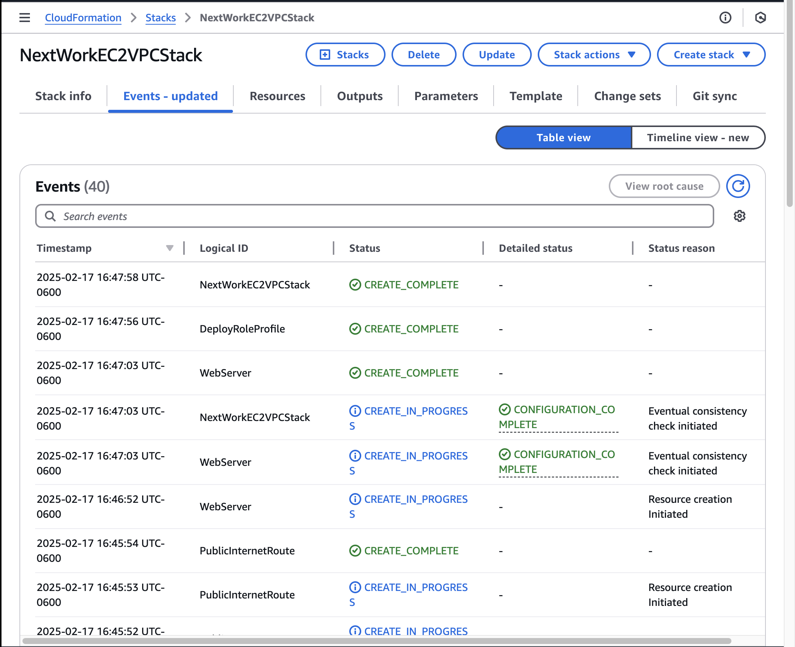
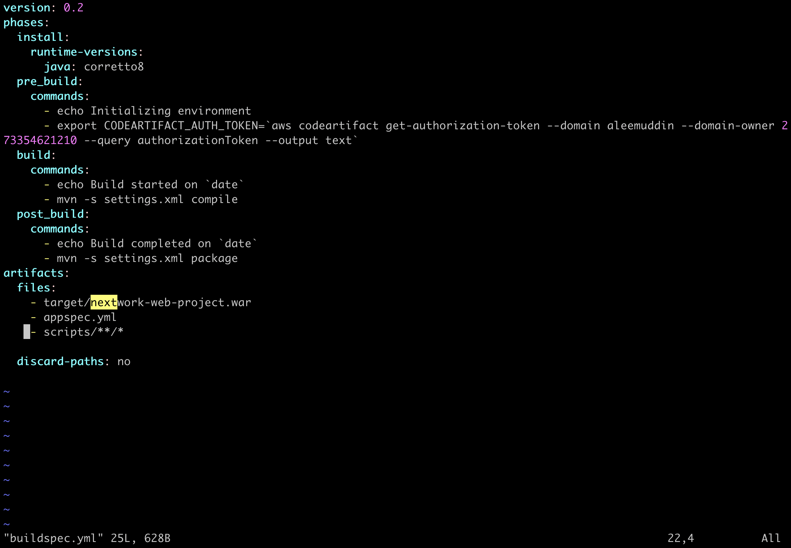
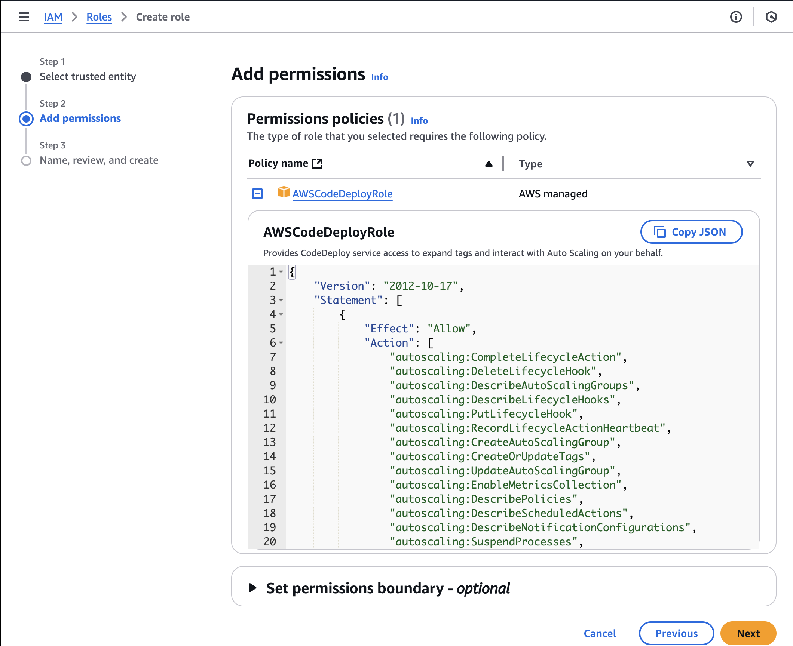
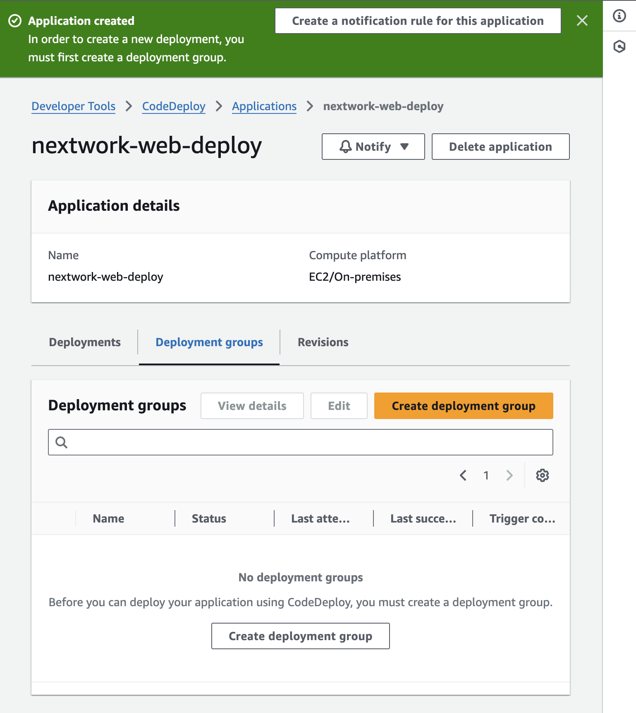
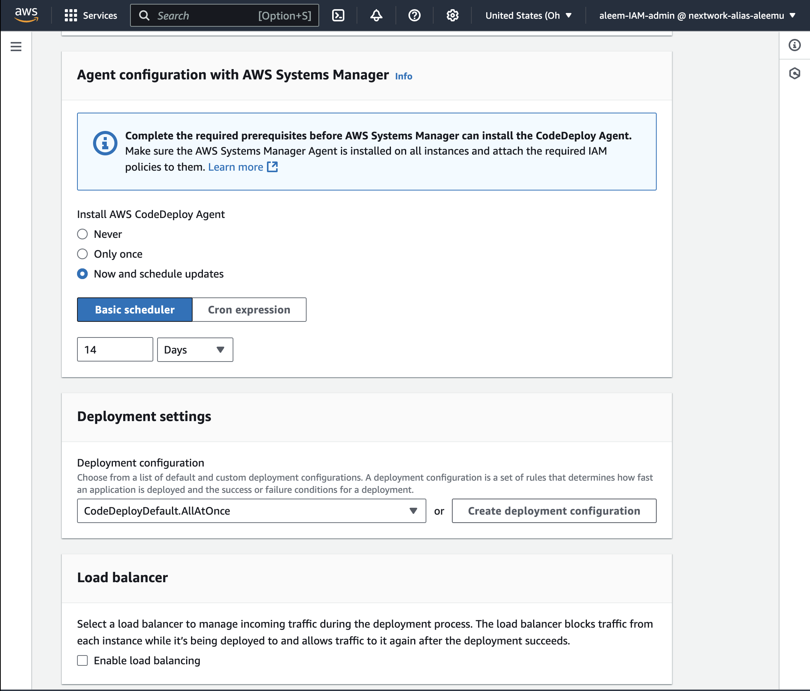
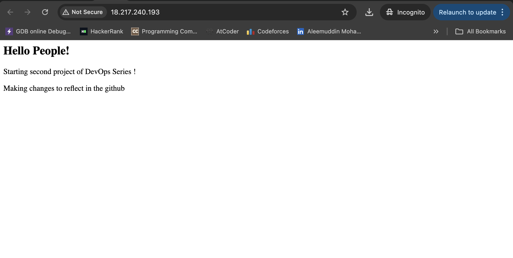

# P5 - Deploy an App with CodeDeploy

**Author:** Aleemuddin Mohammad  
**Email:** aleem2747@gmail.com

---

## Deploy an App with CodeDeploy

---

## Introducing today's project!

### What is AWS CodeDeploy?

AWS CodeDeploy automates software deployments to various compute services, ensuring consistent, reliable application updates. Useful for reducing downtime.

### How I'm using AWS CodeDeploy in this project

Used AWS CodeDeploy to automate deployment of the Java web app across EC2 instances after build completion.

### One thing I didn't expect...

Unexpectedly, configuring the deployment groups and their specifications was more complex than anticipated.

### This project took me...

Completing this project took several hours, primarily due to the setup and troubleshooting of deployment configurations.

---

## Set up an EC2 instance

I set up an EC2 instance and VPC because This EC2 instance will host our Java application. The VPC helps us control who on the internet or other networks can get access to our web app.

We manage production and development environments separately because by having a separate EC2 instance for deploying our application, we avoid the risk of testing any code changes/new features in a live production environment.

To set up my EC2 instance and VPC, I used CloudFormation service. 

---

## Bash scripts

Scripts help you automate tasks run on your computer's terminal. Imagine you have a list of commands to run, like installing software or starting a program. Instead of doing each step by hand every time in your IDE's terminal, you wrte them down.  

### I used three scripts for my project's deployment

The first script I created was install_dependencies.sh script installs all the necessary software that our application needs to run. In this case, it sets up Apache Tomcat and HTTPD on our EC2 instance. 

The second script I created was the start_server.sh script is responsible for starting the Tomcat and HTTPD services on our EC2 instance. This script makes sure that all the necessary services are automatically up and running.

The third script I created was the stop_server.sh. This script is used to stop the Tomcat and HTTPD services on our EC2 instance

---

## Bash scripts

---

## CodeDeploy’s IAM Role

I created an IAM service role for CodeDeploy so that CodeDeploy can deploy to an EC2 instance! Right now, CodeDeploy does not have access to EC2, so we're going to grant access using the AWS Managed AWSCodeDeployRole policy.
 

To set up CodeDeploy’s IAM role, I codedeploy as the usecase in the codedeploy service and created a role.

---

## CodeDeploy application

A CodeDeploy application means an application which works like a folder that holds all the settings it needs for a deployment. 

To create a CodeDeploy application, I had to select a compute platform, which means each compute platform has different requirements and ways of handling applications, so selecting the correct platform lets CodeDeploy knows how to deploy your applica

The compute platform I chose was EC2  because it provides us with virtual servers in the cloud that we can fully control. This means we can install, configure, and manage everything on these servers, which is perfect for running our web application. 

---

## Deployment group

A deployment group means specific instructions for one particular deployment scenario. It defines which servers to use, how to deploy, and what settings to apply for that specific deployment.

### Two key configurations for a deployment group

Environment sets up the type of resources that will be running the application, like the type of servers (EC2 instances) you’re using. 

A CodeDeploy Agent is like a helper installed on your servers (EC2 instances) that communicates with CodeDeploy to get the instructions for deploying your application. It ensures that the servers know what to do when a new version of your applicati

---

## CodeDeploy application

To create my deployment, I had to set up a revision location, which is a place where CodeDeploy looks to find your application's build artifacts, like a zip file or WAR file, stored in an S3 bucket.

My revision location was my s3://nextwork-build-artifacts-aleemuddin/nextwork-wev-build.zip

To visit my web app, I had to visit ec2 instance public IPv4 address and change https to http. 

---

---
